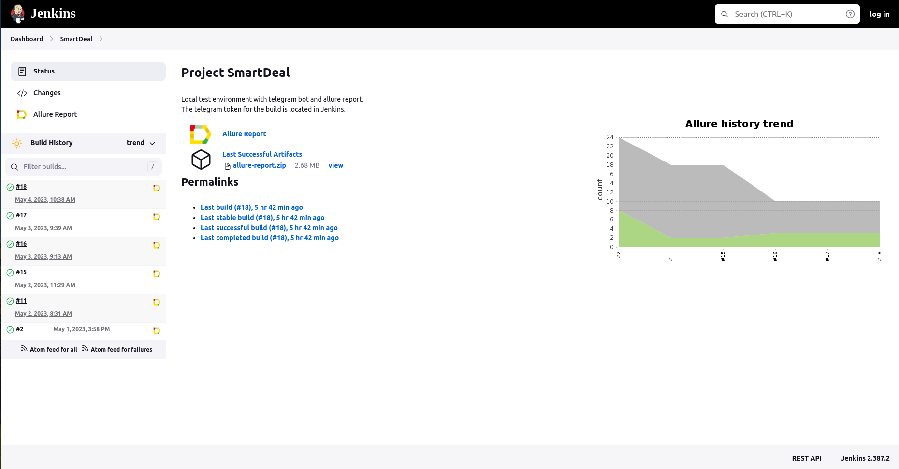
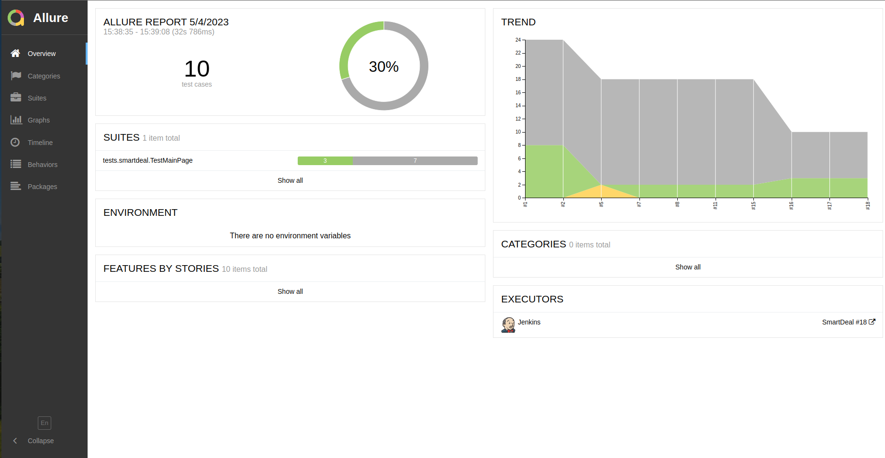
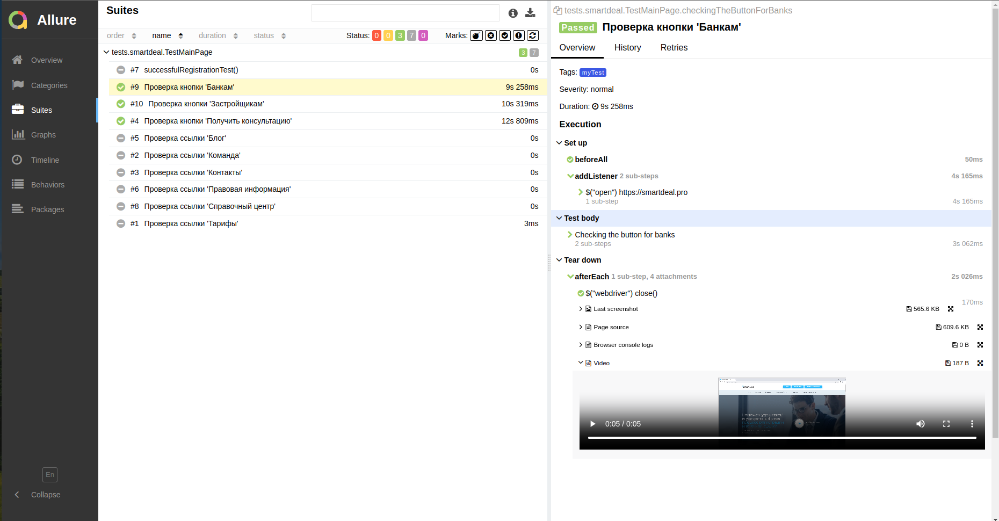
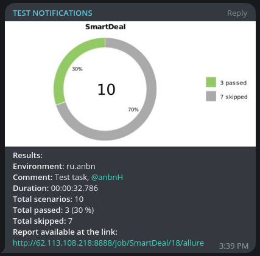

# Проект по автоматизации тестирования для SmartDeal
## <a target="_blank" href="https://www.rshb.ru/">Веб сайт https://smartdeal.pro</a>
## :o2: Содержание:

- <a href="#shinto_shrine-общая-информация-о-тестовом-фреймворке">Общая информация о тестовом фреймворке</a>
- <a href="#shinto_shrine-технологии-и-инструменты">Технологии и инструменты</a>
- <a href="#shinto_shrine-реализованные-проверки">Реализованные проверки</a>
- <a href="#shinto_shrine-сборка-в-Jenkins">Сборка в Jenkins</a>
- <a href="#shinto_shrine-запуск-из-терминала">Запуск из терминала</a>
- <a href="#shinto_shrine-allure-отчет">Allure отчет</a>
- <a href="#shinto_shrine-отчет-в-telegram">Отчет в Telegram</a>
- <a href="#shinto_shrine-видео-примеры-прохождения-тестов">Видео примеры прохождения тестов</a>

## :o2: Общая информация о тестовом фреймворке
&nbsp;&nbsp;&nbsp;Для реализации данного тестового фреймворка на хостинге был развернут VPS
с Ubuntu 22.04, установлен Docker, в Docker Compose подняты Jenkins, Selenoid
and Selenoid UI, настроены роли в Jenkins для доступа, загружены необходимые
образы браузеров. Создан чат бот в Telegram для получения уведомлений о
прохождении тестов из Jenkins. Создан проект в IntellijIDEA, запушен на GitHub.
В коде добавлены все аттачменты для сохранения статистики проходжения тестов,
такие как: Screenshot, PageSource, BrowserConsole and addVideo. 

## :o2: Технологии и инструменты
<p align="center">


</p>

## :o2: Реализованные проверки
- Открытие сайта smartdeal.pro
- Переход по кнопке: 'Банкам'
- Переход по кнопке: 'Застройщикам'
- Переход по кнопке: 'Получить консультацию'
- Переход по ссылке: 'Блог'
- Переход по ссылке: 'Контакты'
- Переход по ссылке: 'Команда'
- Переход по ссылке: 'Справочный центр'
- Переход по ссылке: 'Тарифы'
- Переход по ссылке: 'Правовая информация'
- Открытие окна чата, проверка наличия сообщения

<!--
## :shinto_shrine: Сборка в Jenkins
-->

## </a>*Интеграция с* <a target="_blank" href="https://allure.autotests.cloud/project/1430/dashboards">*Allure TestOps*</a>


### <a target="_blank" href="http://62.113.108.218:8888/job/SmartDeal/">Сборка в Jenkins</a>


<a href="https://htmlacademy.ru">
  Проверкаааааа</a>


<p align="center">
  
</p>

### Параметры сборки в Jenkins:
Сборка в Jenkins
- browser (браузер, по умолчанию chrome)
- browserVersion (default 112.0)
- browserSize (default 1920x1080)
- threads (количество потоков)

## :o2: Запуск из терминала
Локальный запуск:
```bash
gradle clean test
gradle clean ui-test
```

Удаленный запуск:
```bash
clean
-Dbrowser=${BROWSER}
-DbrowserVersion=${BROWSER_VERSION}
-Dthreads=${THREADS}
test
```

## :shinto_shrine: Allure отчет
- ### <a target="_blank" href="http://62.113.108.218:8888/job/SmartDeal/18/allure/">Главный экран отчета</a>
<p align="center">

</p>

- ### Страница с проведенными тестами
<p align="center">

</p>

## :shinto_shrine: Отчет в Telegram
<p align="center">

</p>

## :shinto_shrine: Видео примеры прохождения тестов
> К каждому тесту в отчете прилагается видео. Одно из таких видео представлено ниже.
<p align="center">
  
</p>