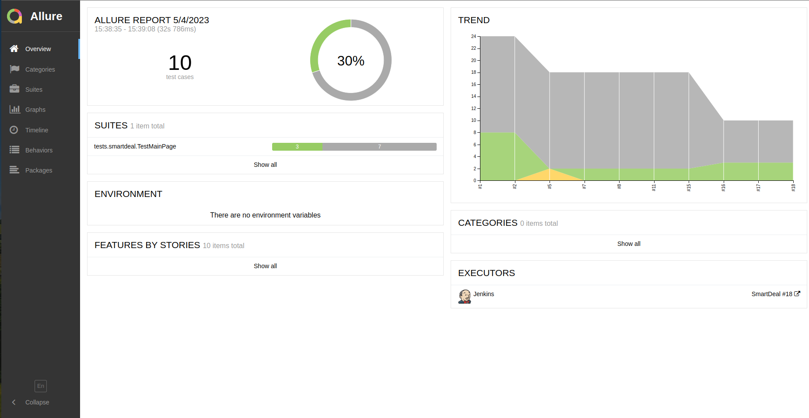
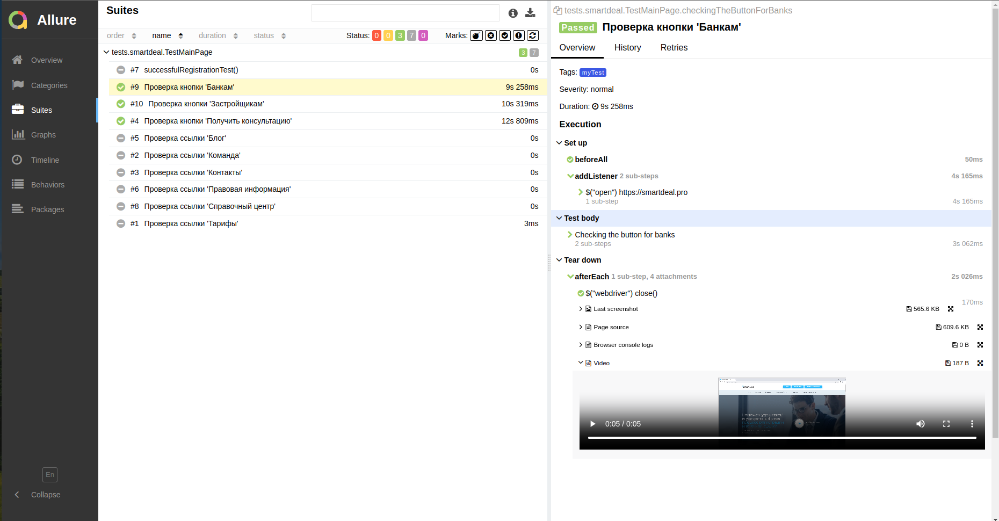

# Проект по автоматизации тестирования для SmartDeal
## <a target="_blank" href="https://www.rshb.ru/">Веб сайт https://smartdeal.pro</a>

## :shinto_shrine: Содержание:

- <a href="#shinto_shrine-общая-информация-о-тестовом-фреймворке">Общая информация о тестовом фреймворке</a>
- <a href="#shinto_shrine-технологии-и-инструменты">Технологии и инструменты</a>
- <a href="#shinto_shrine-реализованные-проверки">Реализованные проверки</a>
- <a href="#shinto_shrine-сборка-в-Jenkins">Сборка в Jenkins</a>
- <a href="#shinto_shrine-запуск-из-терминала">Запуск из терминала</a>
- <a href="#shinto_shrine-allure-отчет">Allure отчет</a>
- <a href="#shinto_shrine-отчет-в-telegram">Отчет в Telegram</a>
- <a href="#shinto_shrine-видео-примеры-прохождения-тестов">Видео примеры прохождения тестов</a>

## :shinto_shrine: Общая информация о тестовом фреймворке
  Для реализации данного тестового фреймворка на хостинге был развернут VPS
с Ubuntu 22.04, установлен Docker, в Docker Compose подняты Jenkins, Selenoid
and Selenoid UI, настроены роли в Jenkins для доступа, загружены необходимые
образы браузеров. Создан чат бот в Telegram для получения уведомлений о
прохождении тестов из Jenkins. Создан проект в IntellijIDEA, запушен на GitHub.
В коде добавлены все аттачменты для сохранения статистики проходжения тестов,
такие как: Screenshot, PageSource, BrowserConsole and addVideo. 

## :shinto_shrine: Технологии и инструменты
<p align="center">


</p>

## :shinto_shrine: Реализованные проверки
- Открытие сайта smartdeal.pro
- Переход по кнопке: 'Банкам'
- Переход по кнопке: 'Застройщикам'
- Переход по кнопке: 'Получить консультацию'
- Переход по ссылке: 'Блог'
- Переход по ссылке: 'Контакты'
- Переход по ссылке: 'Команда'
- Переход по ссылке: 'Справочный центр'
- Переход по ссылке: 'Тарифы'
- Переход по ссылке: 'Правовая информация'
- Открытие окна чата, проверка наличия сообщения

## :shinto_shrine: Сборка в Jenkins
### <a target="_blank" href="http://62.113.108.218:8888/job/SmartDeal/18/allure/">Сборка в Jenkins</a>
<p align="center">

</p>

### Параметры сборки в Jenkins:
Сборка в Jenkins

- browser (браузер, по умолчанию chrome)
- remoteUrl (адрес удаленного сервера selenoid)
- user (пользователль удаленного сервера selenoid)
- password (пароль от удаленного сервера selenoid)

## :shinto_shrine: Запуск из терминала
Локальный запуск:
```
gradle clean test
```

Удаленный запуск:
```
clean
test
-Duser=${USER}
-Dpassword=${PASSWORD}
-Dbrowser=${BROWSER}
-DremoteBrowser=${REMOTE_BROWSER}
```

## :shinto_shrine: Allure отчет
- ### Главный экран отчета
<p align="center">

</p>

- ### Страница с проведенными тестами
<p align="center">

</p>

## :shinto_shrine: Отчет в Telegram
<p align="center">

</p>

## :shinto_shrine: Видео примеры прохождения тестов
> К каждому тесту в отчете прилагается видео. Одно из таких видео представлено ниже.
<p align="center">
  
</p>


# Project in Allure TestOps with manual & automated tests

<a target="_blank" href="https://allure.autotests.cloud/project/%s">allure.autotests.cloud/project/%s</a> (ask admin@qa.guru for access)

# Jenkins job
<a target="_blank" href="https://jenkins.autotests.cloud/job/%s">jenkins.autotests.cloud/job/%s</a>


# USAGE examples

### For run remote tests need fill remote.properties or to pass value:

* browser (default chrome)
* browserVersion (default 89.0)
* browserSize (default 1920x1080)
* browserMobileView (mobile device name, for example iPhone X)
* remoteDriverUrl (url address from selenoid or grid)
* videoStorage (url address where you should get video)
* threads (number of threads)


Run tests with filled remote.properties:
```bash
gradle clean test
```

Run tests with not filled remote.properties:
```bash
gradle clean -DremoteDriverUrl=https://%s:%s@selenoid.autotests.cloud/wd/hub/ -DvideoStorage=https://selenoid.autotests.cloud/video/ -Dthreads=1 test
```

Serve report:
```bash
allure serve build/allure-results
```


###### For further development there are some example tests in src/test/java/cloud.autotests/tests/demowebshop
* remove @Disabled("...") annotation to run tests
```bash
gradle clean demowebshop
```

:heart: <a target="_blank" href="https://qa.guru">qa.guru</a><br/>
:blue_heart: <a target="_blank" href="https://t.me/qa_automation">t.me/qa_automation</a>